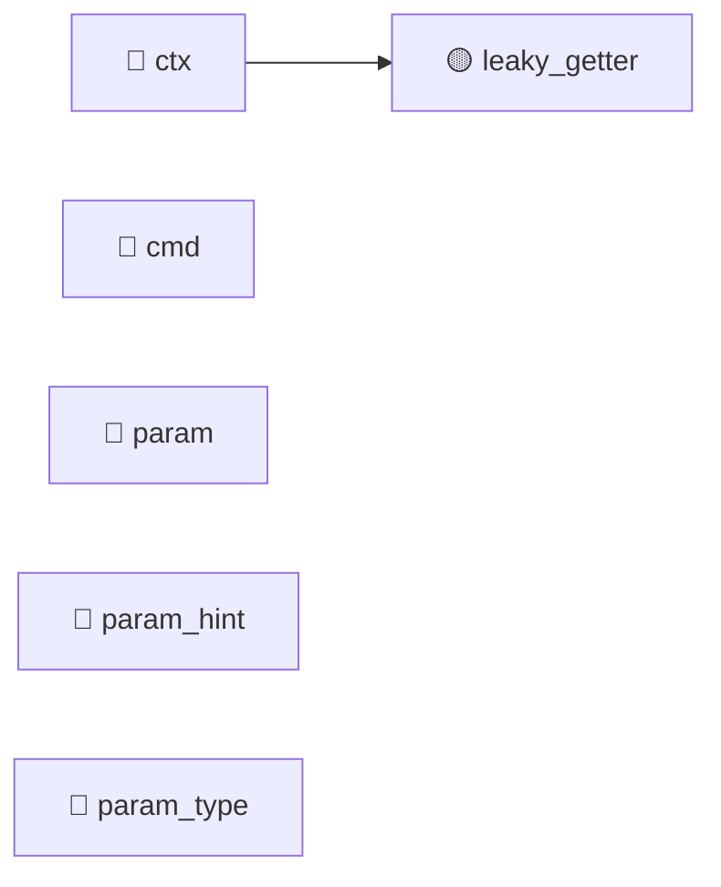

# BadParameter (TGT-07) — 可視化レイヤ（自動生成）

> **対象**: `class BadParameter(UsageError); class MissingParameter(BadParameter)`
> **責務**: パラメータ不正を表す例外。3段継承 (ClickException → UsageError → BadParameter → MissingParameter)
> **総要求数**: 17
> **種別内訳**: 🟦 分岐網羅 (BR) 4, 🟩 同値クラス (EC) 1, 🟥 エラーパス (ER) 1, 🟪 依存切替 (DP) 1, 🔷 クラス継承 (CI) 4, 🟫 状態変数 (SV) 2, ⬛ コードパターン (CP) 1, 🟧 カプセル化 (EN) 3

---

## 1. トリガー階層（Sunburst / Mindmap）

```mermaid
mindmap
  root((BadParameter))
    分岐網羅 (BR)
      BR-07-01: BadParameter.format_message で param_hint
      BR-07-02: param_hint なし + param ありで get_error_hint
      BR-07-03: param_hint, param とも None のとき 'Invalid v
      BR-07-04: MissingParameter で param_type=None かつ pa
    同値クラス (EC)
      EC-07-01: param_hint が str / list / None の3パターン
    エラーパス (ER)
      ER-07-01: BadParameter / MissingParameter が UsageE
    依存切替 (DP)
      DP-07-01: MissingParameter.__init__ が BadParameter
    クラス継承 (CI)
      CI-07-01: ClickException として MissingParameter をキャッ
      CI-07-02: MissingParameter.__init__ の super() チェーン
      CI-07-03: format_message の各階層上書きが意図通り差別化されている
      CI-07-04: UsageError を期待する呼び出しで MissingParameter を
    状態変数 (SV)
      SV-07-01: 全階層の初期化後に message/ctx/cmd/param/param_hi
      SV-07-02: format_message が self.param / self.param
    コードパターン (CP)
      CP-07-01: 多段 super() チェーンが循環/欠落なく機能
    カプセル化 (EN)
      EN-07-01: BadParameter は message 必須、MissingParamet
      EN-07-02: MissingParameter(message=None) が内部で "" に
      EN-07-03: self.ctx を介して外部が Context を変更可能（public fi
```

## 2. 種別分布の流量（Sankey）

```mermaid
sankey-beta

BadParameter,分岐網羅 (BR),4
BadParameter,同値クラス (EC),1
BadParameter,エラーパス (ER),1
BadParameter,依存切替 (DP),1
BadParameter,クラス継承 (CI),4
BadParameter,状態変数 (SV),2
BadParameter,コードパターン (CP),1
BadParameter,カプセル化 (EN),3
分岐網羅 (BR),優先度:high,3
分岐網羅 (BR),優先度:medium,1
同値クラス (EC),優先度:high,1
エラーパス (ER),優先度:high,1
依存切替 (DP),優先度:high,1
クラス継承 (CI),優先度:high,3
クラス継承 (CI),優先度:medium,1
状態変数 (SV),優先度:high,1
コードパターン (CP),優先度:high,1
カプセル化 (EN),優先度:high,2
カプセル化 (EN),優先度:medium,1
```

## 3. 複合影響のヒートマップ（field × risk）

| field | missing_validation | leaky_getter | leaky_setter | unintended_mutability | external_mutation | invariant_breach | public_mutable_field |
|---|---|---|---|---|---|---|---|
| ctx | — | 🟡 | — | — | — | — | — |
| cmd | — | — | — | — | — | — | — |
| param | — | — | — | — | — | — | — |
| param_hint | — | — | — | — | — | — | — |
| param_type | — | — | — | — | — | — | — |

**凡例**: 🔴 high / 🟡 medium / 🟢 low / — 検出なし

## 4. トリガー相互関係（Chord 風 Flowchart）



---

## 自動生成のメタ情報

- ツール: `scripts/generate_visualizations.py`
- 入力スキーマ: TRM v3.1 (`templates/trm-schema.yaml`)
- 図解形式: Mermaid + Markdown
- 対象読者: 非エンジニア + 技術系PM + レビュアー