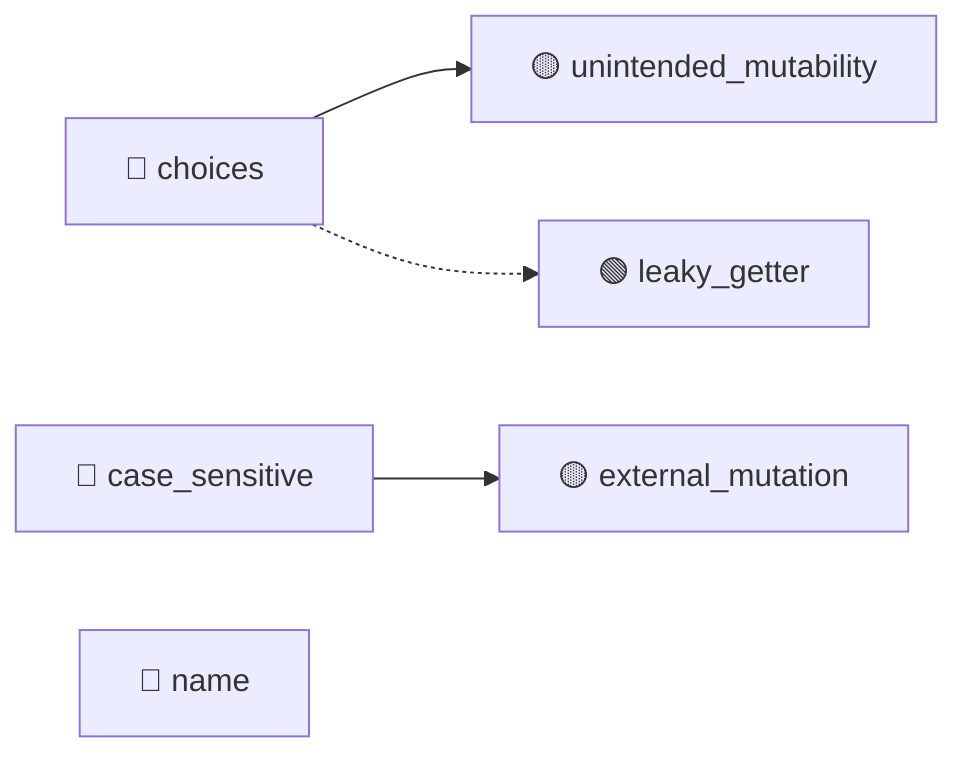

# Choice (TGT-03) — 可視化レイヤ（自動生成）

> **対象**: `class Choice(ParamType, Generic[ParamTypeValue])`
> **責務**: 候補値集合に対する入力検証と正規化
> **総要求数**: 36
> **種別内訳**: 🟦 分岐網羅 (BR) 12, 🟩 同値クラス (EC) 5, 🟥 エラーパス (ER) 3, 🟪 依存切替 (DP) 2, 🔷 クラス継承 (CI) 4, 🟫 状態変数 (SV) 4, ⬛ コードパターン (CP) 2, 🟧 カプセル化 (EN) 4

---

## 1. トリガー階層（Sunburst / Mindmap）

```mermaid
mindmap
  root((Choice))
    分岐網羅 (BR)
      BR-03-01: Enum 型 choice が choice.name で正規化されること
      BR-03-02: 非Enum の choice が str(choice) で正規化されること
      BR-03-03: ctx.token_normalize_func が設定されているとき適用される
      BR-03-04: ctx が None または token_normalize_func 未設定で
      ...他8件
    同値クラス (EC)
      EC-03-01: str choices / int choices / Enum choices
      EC-03-02: case_sensitive True/False の両モードを網羅
      EC-03-03: 空 ctx / token_normalize_func あり ctx の両パタ
      EC-03-04: option/argument × required True/False の4
      ...他1件
    エラーパス (ER)
      ER-03-01: convert が候補外値で BadParameter を投げること
      ER-03-02: 空の choices で Choice を構築した場合の挙動（要仕様確認、実装で
      ER-03-03: __init__ に iterable でない引数を渡した場合 TypeErro
    依存切替 (DP)
      DP-03-01: to_info_dict が super().to_info_dict() を呼
      DP-03-02: convert が _normalized_mapping と normaliz
    クラス継承 (CI)
      CI-03-01: to_info_dict で super() 呼び出しの結果に choices/
      CI-03-02: convert のオーバーライドが ParamType.convert と異なる
      CI-03-03: Generic[T] 型パラメータが choices の要素型として正しく機能す
      CI-03-04: ParamType 型として Choice を扱えること（__call__, f
    状態変数 (SV)
      SV-03-01: __init__ 後に self.choices が tuple 型、self.
      SV-03-02: choices は Iterable を受け取るが内部では Sequence (
      SV-03-03: choices なしでは Choice を構築できないこと（TypeError）
      SV-03-04: convert の呼び出しが self.choices を変更しないこと
    コードパターン (CP)
      CP-03-01: Generic[T] 経由の型推論が正しく効くこと
      CP-03-02: gettext _() / ngettext が translation cat
    カプセル化 (EN)
      EN-03-01: self.choices, self.case_sensitive は publ
      EN-03-02: self.choices が tuple 型であるため、要素参照経由の漏洩があっ
      EN-03-03: Choice(choices=..., case_sensitive=...) 
      EN-03-04: convert / normalize_choice / shell_compl
```

## 2. 種別分布の流量（Sankey）

```mermaid
sankey-beta

Choice,分岐網羅 (BR),12
Choice,同値クラス (EC),5
Choice,エラーパス (ER),3
Choice,依存切替 (DP),2
Choice,クラス継承 (CI),4
Choice,状態変数 (SV),4
Choice,コードパターン (CP),2
Choice,カプセル化 (EN),4
分岐網羅 (BR),優先度:high,6
分岐網羅 (BR),優先度:medium,5
分岐網羅 (BR),優先度:low,1
同値クラス (EC),優先度:high,2
同値クラス (EC),優先度:medium,2
エラーパス (ER),優先度:high,2
エラーパス (ER),優先度:medium,1
依存切替 (DP),優先度:high,1
依存切替 (DP),優先度:medium,1
クラス継承 (CI),優先度:high,2
クラス継承 (CI),優先度:medium,2
状態変数 (SV),優先度:high,2
状態変数 (SV),優先度:medium,2
コードパターン (CP),優先度:high,1
コードパターン (CP),優先度:medium,1
カプセル化 (EN),優先度:high,2
カプセル化 (EN),優先度:medium,2
```

## 3. 複合影響のヒートマップ（field × risk）

| field | missing_validation | leaky_getter | leaky_setter | unintended_mutability | external_mutation | invariant_breach | public_mutable_field |
|---|---|---|---|---|---|---|---|
| choices | — | 🟢 | — | 🟡 | — | — | — |
| case_sensitive | — | — | — | — | 🟡 | — | — |
| name | — | — | — | — | — | — | — |

**凡例**: 🔴 high / 🟡 medium / 🟢 low / — 検出なし

## 4. トリガー相互関係（Chord 風 Flowchart）



---

## 自動生成のメタ情報

- ツール: `scripts/generate_visualizations.py`
- 入力スキーマ: TRM v3.1 (`templates/trm-schema.yaml`)
- 図解形式: Mermaid + Markdown
- 対象読者: 非エンジニア + 技術系PM + レビュアー