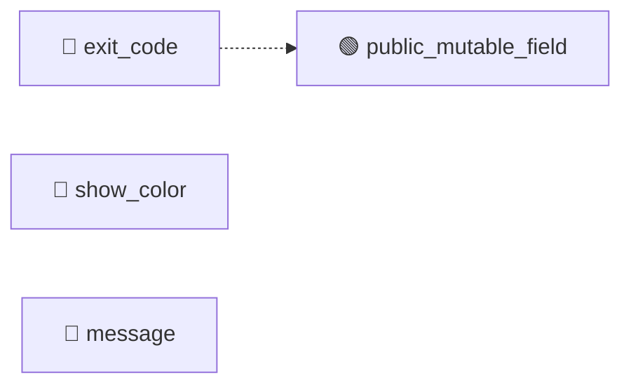

# ClickException (TGT-06) — 可視化レイヤ（自動生成）

> **対象**: `class ClickException(Exception)`
> **責務**: Click が処理してユーザーに表示する例外の基底
> **総要求数**: 12
> **種別内訳**: 🟦 分岐網羅 (BR) 2, 🟩 同値クラス (EC) 1, 🟥 エラーパス (ER) 1, 🔷 クラス継承 (CI) 2, 🟫 状態変数 (SV) 2, ⬛ コードパターン (CP) 1, 🟧 カプセル化 (EN) 3

---

## 1. トリガー階層（Sunburst / Mindmap）

```mermaid
mindmap
  root((ClickException))
    分岐網羅 (BR)
      BR-06-01: show() で file=None のとき stderr に出力されること
      BR-06-02: show() で file 指定時にその file に出力されること
    同値クラス (EC)
      EC-06-01: message が空文字列、通常文字列、マルチライン文字列の各パターンで動作
    エラーパス (ER)
      ER-06-01: ClickException を raise/catch できること（例外プロト
    クラス継承 (CI)
      CI-06-01: Exception 型として ClickException をキャッチ可能
      CI-06-02: 派生 UsageError / FileError が format_messa
    状態変数 (SV)
      SV-06-01: __init__ 後に message / show_color がセットされて
      SV-06-02: message なしで ClickException を構築できないこと
    コードパターン (CP)
      CP-06-01: format_message / __str__ が Template Meth
    カプセル化 (EN)
      EN-06-01: message が必須引数で、欠如すると TypeError
      EN-06-02: exit_code は ClassVar だが、派生で上書き可能（design 
      EN-06-03: show_color はインスタンス生成時に決定され、後からの変更で show(
```

## 2. 種別分布の流量（Sankey）

```mermaid
sankey-beta

ClickException,分岐網羅 (BR),2
ClickException,同値クラス (EC),1
ClickException,エラーパス (ER),1
ClickException,クラス継承 (CI),2
ClickException,状態変数 (SV),2
ClickException,コードパターン (CP),1
ClickException,カプセル化 (EN),3
分岐網羅 (BR),優先度:high,1
分岐網羅 (BR),優先度:medium,1
同値クラス (EC),優先度:high,1
エラーパス (ER),優先度:high,1
クラス継承 (CI),優先度:high,1
クラス継承 (CI),優先度:medium,1
状態変数 (SV),優先度:high,1
状態変数 (SV),優先度:medium,1
コードパターン (CP),優先度:high,1
カプセル化 (EN),優先度:high,2
カプセル化 (EN),優先度:medium,1
```

## 3. 複合影響のヒートマップ（field × risk）

| field | missing_validation | leaky_getter | leaky_setter | unintended_mutability | external_mutation | invariant_breach | public_mutable_field |
|---|---|---|---|---|---|---|---|
| exit_code | — | — | — | — | — | — | 🟢 |
| show_color | — | — | — | — | — | — | — |
| message | — | — | — | — | — | — | — |

**凡例**: 🔴 high / 🟡 medium / 🟢 low / — 検出なし

## 4. トリガー相互関係（Chord 風 Flowchart）



---

## 自動生成のメタ情報

- ツール: `scripts/generate_visualizations.py`
- 入力スキーマ: TRM v3.1 (`templates/trm-schema.yaml`)
- 図解形式: Mermaid + Markdown
- 対象読者: 非エンジニア + 技術系PM + レビュアー