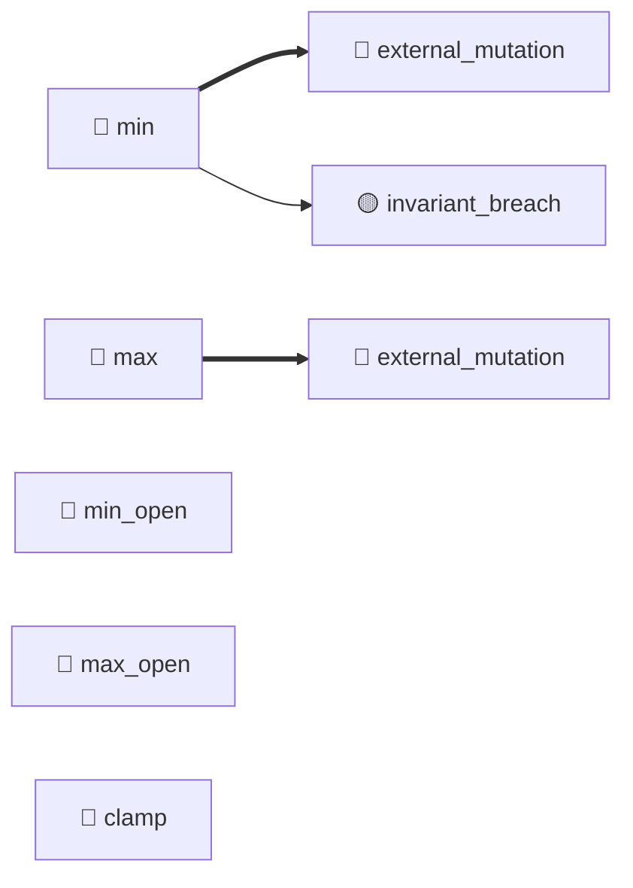

# IntRange (TGT-05) — 可視化レイヤ（自動生成）

> **対象**: `class IntRange(_NumberRangeBase, IntParamType)`
> **責務**: 整数の範囲制約付き型。min/max、open/closed、clamp を扱う
> **総要求数**: 48
> **種別内訳**: 🟦 分岐網羅 (BR) 10, 🟩 同値クラス (EC) 5, 🟨 境界値 (BV) 10, 🟥 エラーパス (ER) 2, 🟪 依存切替 (DP) 2, 🔷 クラス継承 (CI) 6, 🟫 状態変数 (SV) 5, ⬛ コードパターン (CP) 2, 🟧 カプセル化 (EN) 6

---

## 1. トリガー階層（Sunburst / Mindmap）

```mermaid
mindmap
  root((IntRange))
    分岐網羅 (BR)
      BR-05-01: min=None のとき下限チェックをスキップして値を返すこと
      BR-05-02: min 指定かつ min_open=False で value==min のとき
      BR-05-03: min 指定かつ min_open=True で value==min のとき 
      BR-05-04: max=None のとき上限チェックをスキップ
      ...他6件
    同値クラス (EC)
      EC-05-01: min/max のどちらか片方指定 / 両方指定 / 両方None の3パターン
      EC-05-02: min_open/max_open の4通り組合せ
      EC-05-03: clamp True/False × 範囲内/下限違反/上限違反 の6パターン
      EC-05-04: 入力 value の種別（int, int文字列, float文字列, 非数値）
      ...他1件
    境界値 (BV)
      BV-05-01: min_open=False で min, min-1, min+1 の3値
      BV-05-02: min_open=True で min, min-1, min+1 の3値
      BV-05-03: max_open=False で max, max-1, max+1 の3値
      BV-05-04: max_open=True で max, max-1, max+1 の3値
      ...他6件
    エラーパス (ER)
      ER-05-01: 変換不可能な文字列で BadParameter を投げること（_number_c
      ER-05-02: 範囲外値 (clamp=False) で BadParameter を投げること
    依存切替 (DP)
      DP-05-01: super().convert() で _NumberParamTypeBase
      DP-05-02: _clamp の実装は IntRange では NotImplementedEr
    クラス継承 (CI)
      CI-05-01: IntRange が _NumberRangeBase._clamp を確実に実
      CI-05-02: convert 内の super().convert() 呼び出しが _Numb
      CI-05-03: MRO 順序: IntRange.__mro__ が [_NumberRange
      CI-05-04: _clamp の IntRange 実装が int を返すこと（FloatRan
      ...他2件
    状態変数 (SV)
      SV-05-01: __init__ 引数が None 既定で field が全て格納されること
      SV-05-02: min/max は float | None 型宣言だが、IntRange 使用
      SV-05-03: convert の結果が self.min/max/min_open/max_o
      SV-05-04: convert の呼び出しが self.min/max 等を変更しないこと
      ...他1件
    コードパターン (CP)
      CP-05-01: Strategy パターンでの operator.le/lt 動的選択が正しく機
      CP-05-02: ダイヤモンド継承下での MRO が意図通りに解決されていること
    カプセル化 (EN)
      EN-05-01: min/max/min_open/max_open/clamp は public
      EN-05-02: 構築後に self.min を変更した場合、convert の挙動がその変更を即
      EN-05-03: IntRange() 引数なしで構築可能（全field に既定値）。この挙動を意
      EN-05-04: min > max を構築時に許容する設計の是非を検証要求として残す（ENR-0
      ...他2件
```

## 2. 種別分布の流量（Sankey）

```mermaid
sankey-beta

IntRange,分岐網羅 (BR),10
IntRange,同値クラス (EC),5
IntRange,境界値 (BV),10
IntRange,エラーパス (ER),2
IntRange,依存切替 (DP),2
IntRange,クラス継承 (CI),6
IntRange,状態変数 (SV),5
IntRange,コードパターン (CP),2
IntRange,カプセル化 (EN),6
分岐網羅 (BR),優先度:high,8
分岐網羅 (BR),優先度:medium,2
同値クラス (EC),優先度:high,4
同値クラス (EC),優先度:medium,1
境界値 (BV),優先度:high,8
境界値 (BV),優先度:medium,2
エラーパス (ER),優先度:high,2
依存切替 (DP),優先度:high,2
クラス継承 (CI),優先度:high,5
クラス継承 (CI),優先度:medium,1
状態変数 (SV),優先度:high,4
状態変数 (SV),優先度:medium,1
コードパターン (CP),優先度:high,2
カプセル化 (EN),優先度:high,5
カプセル化 (EN),優先度:medium,1
```

## 3. 複合影響のヒートマップ（field × risk）

| field | missing_validation | leaky_getter | leaky_setter | unintended_mutability | external_mutation | invariant_breach | public_mutable_field |
|---|---|---|---|---|---|---|---|
| min | — | — | — | — | 🔴 | 🟡 | — |
| max | — | — | — | — | 🔴 | — | — |
| min_open | — | — | — | — | — | — | — |
| max_open | — | — | — | — | — | — | — |
| clamp | — | — | — | — | — | — | — |

**凡例**: 🔴 high / 🟡 medium / 🟢 low / — 検出なし

## 4. トリガー相互関係（Chord 風 Flowchart）



---

## 自動生成のメタ情報

- ツール: `scripts/generate_visualizations.py`
- 入力スキーマ: TRM v3.1 (`templates/trm-schema.yaml`)
- 図解形式: Mermaid + Markdown
- 対象読者: 非エンジニア + 技術系PM + レビュアー