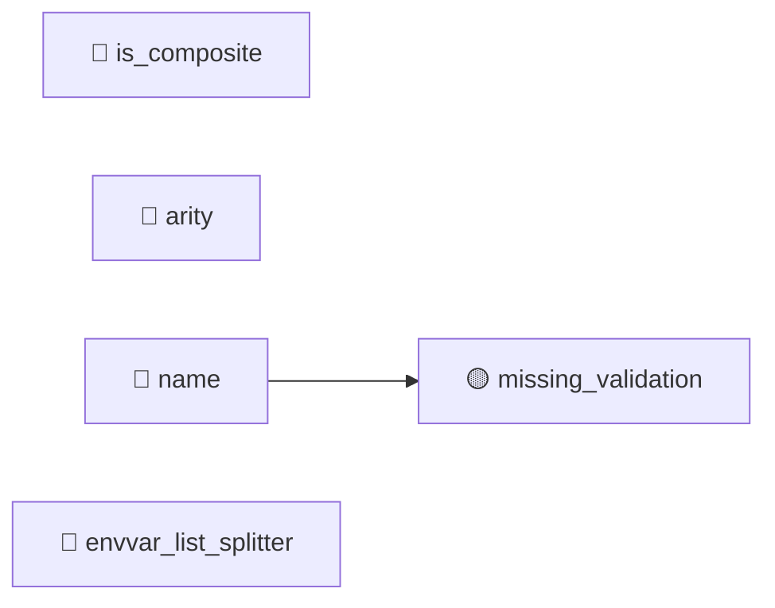

# ParamType (TGT-01) — 可視化レイヤ（自動生成）

> **対象**: `class ParamType`
> **責務**: パラメータ型の基底。convert protocol と ClassVar 属性を提供
> **総要求数**: 19
> **種別内訳**: 🟦 分岐網羅 (BR) 5, 🟩 同値クラス (EC) 3, 🟥 エラーパス (ER) 2, 🟪 依存切替 (DP) 1, 🔷 クラス継承 (CI) 4, ⬛ コードパターン (CP) 2, 🟧 カプセル化 (EN) 2

---

## 1. トリガー階層（Sunburst / Mindmap）

```mermaid
mindmap
  root((ParamType))
    分岐網羅 (BR)
      BR-01-01: __call__(None) が convert を呼ばずに None を返すこ
      BR-01-02: __call__(非None値) が convert を呼び出すこと
      BR-01-03: to_info_dict で name 属性がある場合に self.name が
      BR-01-04: to_info_dict で name 属性がない場合に param_type 
      ...他1件
    同値クラス (EC)
      EC-01-01: convert の既定動作が identity（受け取った値をそのまま返す）であ
      EC-01-02: split_envvar_value が None splitter のとき空白
      EC-01-03: shell_complete の既定が空リストを返すこと
    エラーパス (ER)
      ER-01-01: fail 呼び出しで BadParameter が例外として伝播すること
      ER-01-02: name 未設定のサブクラスで to_info_dict は Attribute
    依存切替 (DP)
      DP-01-01: fail が BadParameter(ctx, param) を正しく構築して
    クラス継承 (CI)
      CI-01-01: 派生クラスのインスタンスに対して __call__ が派生の convert を
      CI-01-02: すべての派生クラスが convert を有意に上書きしていること（identit
      CI-01-03: 派生クラスの name 属性がクラス特有の値に設定されていること
      CI-01-04: convert が Parameter=None, Context=None を
    コードパターン (CP)
      CP-01-01: Template Method パターン: 基底の既定動作と派生の上書きが共存で
      CP-01-02: ClassVar 宣言された属性をインスタンス単位で上書きした場合、他インスタン
    カプセル化 (EN)
      EN-01-01: name, is_composite, arity, envvar_list_s
      EN-01-02: name 未設定のサブクラスでも to_info_dict が例外を投げずに完了
```

## 2. 種別分布の流量（Sankey）

```mermaid
sankey-beta

ParamType,分岐網羅 (BR),5
ParamType,同値クラス (EC),3
ParamType,エラーパス (ER),2
ParamType,依存切替 (DP),1
ParamType,クラス継承 (CI),4
ParamType,コードパターン (CP),2
ParamType,カプセル化 (EN),2
分岐網羅 (BR),優先度:high,2
分岐網羅 (BR),優先度:medium,3
同値クラス (EC),優先度:high,1
同値クラス (EC),優先度:medium,2
エラーパス (ER),優先度:high,1
エラーパス (ER),優先度:medium,1
依存切替 (DP),優先度:medium,1
クラス継承 (CI),優先度:high,2
クラス継承 (CI),優先度:medium,2
コードパターン (CP),優先度:high,1
コードパターン (CP),優先度:medium,1
カプセル化 (EN),優先度:high,1
カプセル化 (EN),優先度:medium,1
```

## 3. 複合影響のヒートマップ（field × risk）

| field | missing_validation | leaky_getter | leaky_setter | unintended_mutability | external_mutation | invariant_breach | public_mutable_field |
|---|---|---|---|---|---|---|---|
| is_composite | — | — | — | — | — | — | — |
| arity | — | — | — | — | — | — | — |
| name | 🟡 | — | — | — | — | — | — |
| envvar_list_splitter | — | — | — | — | — | — | — |

**凡例**: 🔴 high / 🟡 medium / 🟢 low / — 検出なし

## 4. トリガー相互関係（Chord 風 Flowchart）



---

## 自動生成のメタ情報

- ツール: `scripts/generate_visualizations.py`
- 入力スキーマ: TRM v3.1 (`templates/trm-schema.yaml`)
- 図解形式: Mermaid + Markdown
- 対象読者: 非エンジニア + 技術系PM + レビュアー