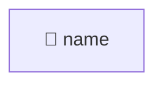

# StringParamType (TGT-02) — 可視化レイヤ（自動生成）

> **対象**: `class StringParamType(ParamType)`
> **責務**: bytes/str 入力を適切な文字列に変換する
> **総要求数**: 17
> **種別内訳**: 🟦 分岐網羅 (BR) 8, 🟩 同値クラス (EC) 3, 🟨 境界値 (BV) 1, 🟥 エラーパス (ER) 1, 🔷 クラス継承 (CI) 2, ⬛ コードパターン (CP) 1, 🟧 カプセル化 (EN) 1

---

## 1. トリガー階層（Sunburst / Mindmap）

```mermaid
mindmap
  root((StringParamType))
    分岐網羅 (BR)
      BR-02-01: bytes 入力時に argv encoding でデコードされること
      BR-02-02: 非bytes入力時に str(value) が返されること
      BR-02-03: argv encoding 失敗時に fs encoding にフォールバックす
      BR-02-04: fs_enc == enc の場合に直接 utf-8 replace へ進むこと
      ...他4件
    同値クラス (EC)
      EC-02-01: bytes / str / int / float 各型の入力で期待通り変換され
      EC-02-02: ASCII 可能な bytes と UTF-8 特殊文字含む bytes の両方
      EC-02-03: argv encoding と fs encoding が同一の場合と異なる場合
    境界値 (BV)
      BV-02-01: 空の bytes b'' と空文字列 '' でクラッシュしないこと
    エラーパス (ER)
      ER-02-01: 全エンコーディングで失敗しても utf-8 replace で何らかの str 
    クラス継承 (CI)
      CI-02-01: ParamType.convert と StringParamType.conv
      CI-02-02: ParamType 型の変数として StringParamType を使っても 
    コードパターン (CP)
      CP-02-01: 多段エンコーディングフォールバックがどの順序でも完了すること
    カプセル化 (EN)
      EN-02-01: name ClassVar は実行時に変更しても同クラスの他インスタンスへ波及し
```

## 2. 種別分布の流量（Sankey）

```mermaid
sankey-beta

StringParamType,分岐網羅 (BR),8
StringParamType,同値クラス (EC),3
StringParamType,境界値 (BV),1
StringParamType,エラーパス (ER),1
StringParamType,クラス継承 (CI),2
StringParamType,コードパターン (CP),1
StringParamType,カプセル化 (EN),1
分岐網羅 (BR),優先度:high,4
分岐網羅 (BR),優先度:medium,3
分岐網羅 (BR),優先度:low,1
同値クラス (EC),優先度:high,1
同値クラス (EC),優先度:medium,1
クラス継承 (CI),優先度:high,1
クラス継承 (CI),優先度:medium,1
```

## 3. 複合影響のヒートマップ（field × risk）

> (state_variables または encapsulation_risks が空のためヒートマップ対象外)

## 4. トリガー相互関係（Chord 風 Flowchart）



---

## 自動生成のメタ情報

- ツール: `scripts/generate_visualizations.py`
- 入力スキーマ: TRM v3.1 (`templates/trm-schema.yaml`)
- 図解形式: Mermaid + Markdown
- 対象読者: 非エンジニア + 技術系PM + レビュアー