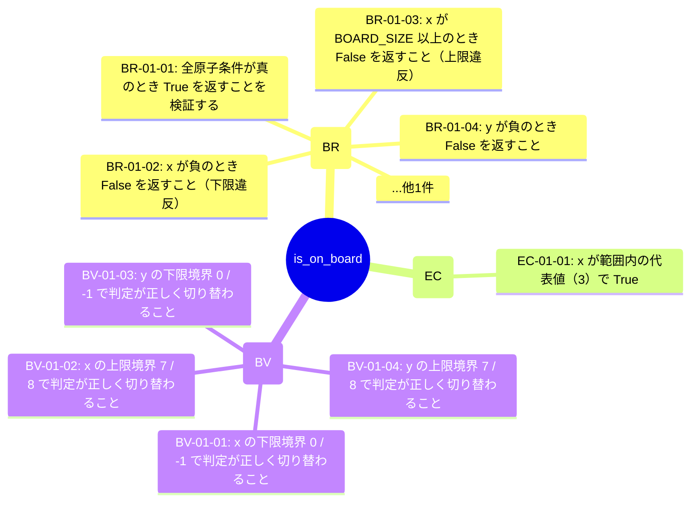

# is_on_board (TGT-01) — 可視化レイヤ（自動生成）

> **対象**: `is_on_board(x: int, y: int) -> bool`
> **責務**: 座標 (x, y) が 8×8 盤面の範囲内かを判定する
> **総要求数**: 10
> **種別内訳**: 🟦 分岐網羅 (BR) 5, 🟩 同値クラス (EC) 1, 🟨 境界値 (BV) 4

---

## 1. トリガー階層（Sunburst / Mindmap）



## 2. 種別分布の流量（Sankey）

```mermaid
sankey-beta

is_on_board,分岐網羅 (BR),5
is_on_board,同値クラス (EC),1
is_on_board,境界値 (BV),4
分岐網羅 (BR),優先度:high,4
同値クラス (EC),優先度:high,1
境界値 (BV),優先度:high,4
```

## 3. 複合影響のヒートマップ（field × risk）

> (state_variables または encapsulation_risks が空のためヒートマップ対象外)

## 4. トリガー相互関係（Chord 風 Flowchart）

> (state_variables が空のため Chord 生成不可)

---

## 自動生成のメタ情報

- ツール: `scripts/generate_visualizations.py`
- 入力スキーマ: TRM v3.1 (`templates/trm-schema.yaml`)
- 図解形式: Mermaid + Markdown
- 対象読者: 非エンジニア + 技術系PM + レビュアー