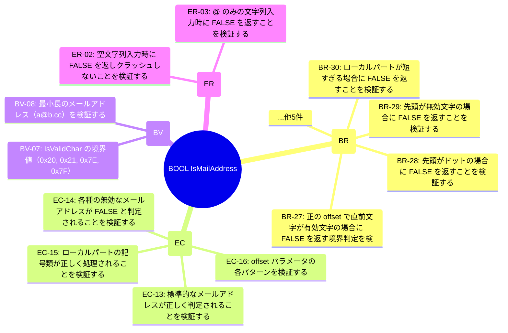

# BOOL IsMailAddress (TGT-04) — 可視化レイヤ（自動生成）

> **対象**: `BOOL IsMailAddress(const wchar_t* pszBuf, int offset, size_t cchBuf, int* pnAddressLength)`
> **責務**: 文字列バッファ中の指定位置がメールアドレスの先頭であるかを判定する。 ローカルパート@ドメインパートの形式を検証し、TRUEの場合はアドレス長を出力する。

> **総要求数**: 17
> **種別内訳**: 🟦 分岐網羅 (BR) 9, 🟩 同値クラス (EC) 4, 🟨 境界値 (BV) 2, 🟥 エラーパス (ER) 2

---

## 1. トリガー階層（Sunburst / Mindmap）



## 2. 種別分布の流量（Sankey）

```mermaid
sankey-beta

BOOL IsMailAddress,分岐網羅 (BR),9
BOOL IsMailAddress,同値クラス (EC),4
BOOL IsMailAddress,境界値 (BV),2
BOOL IsMailAddress,エラーパス (ER),2
分岐網羅 (BR),優先度:high,5
分岐網羅 (BR),優先度:medium,4
同値クラス (EC),優先度:high,2
同値クラス (EC),優先度:medium,2
境界値 (BV),優先度:high,1
境界値 (BV),優先度:medium,1
エラーパス (ER),優先度:high,1
エラーパス (ER),優先度:medium,1
```

## 3. 複合影響のヒートマップ（field × risk）

> (state_variables または encapsulation_risks が空のためヒートマップ対象外)

## 4. トリガー相互関係（Chord 風 Flowchart）

> (state_variables が空のため Chord 生成不可)

---

## 自動生成のメタ情報

- ツール: `scripts/generate_visualizations.py`
- 入力スキーマ: TRM v3.1 (`templates/trm-schema.yaml`)
- 図解形式: Mermaid + Markdown
- 対象読者: 非エンジニア + 技術系PM + レビュアー