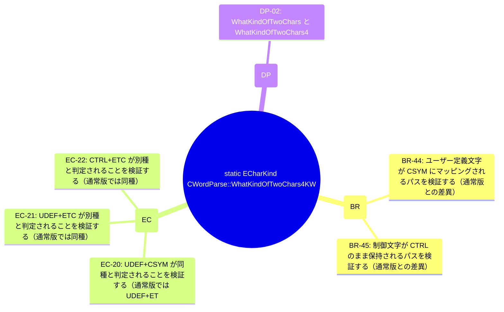

# static ECharKind CWordParse::WhatKindOfTwoChars4KW (TGT-06) — 可視化レイヤ（自動生成）

> **対象**: `static ECharKind CWordParse::WhatKindOfTwoChars4KW(ECharKind kindPre, ECharKind kindCur)`
> **責務**: WhatKindOfTwoChars のキーワード検索用バリアント。 基本ロジックは同一だが、ユーザー定義文字と制御文字のマッピング規則が異なる。

> **総要求数**: 6
> **種別内訳**: 🟦 分岐網羅 (BR) 2, 🟩 同値クラス (EC) 3, 🟪 依存切替 (DP) 1

---

## 1. トリガー階層（Sunburst / Mindmap）



## 2. 種別分布の流量（Sankey）

```mermaid
sankey-beta

static ECharKind CWordParse::WhatKindOfTwoChars4KW,分岐網羅 (BR),2
static ECharKind CWordParse::WhatKindOfTwoChars4KW,同値クラス (EC),3
static ECharKind CWordParse::WhatKindOfTwoChars4KW,依存切替 (DP),1
分岐網羅 (BR),優先度:high,2
同値クラス (EC),優先度:high,3
依存切替 (DP),優先度:high,1
```

## 3. 複合影響のヒートマップ（field × risk）

> (state_variables または encapsulation_risks が空のためヒートマップ対象外)

## 4. トリガー相互関係（Chord 風 Flowchart）

> (state_variables が空のため Chord 生成不可)

---

## 自動生成のメタ情報

- ツール: `scripts/generate_visualizations.py`
- 入力スキーマ: TRM v3.1 (`templates/trm-schema.yaml`)
- 図解形式: Mermaid + Markdown
- 対象読者: 非エンジニア + 技術系PM + レビュアー