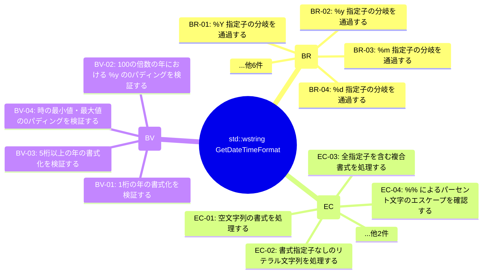

# std::wstring GetDateTimeFormat (TGT-01) — 可視化レイヤ（自動生成）

> **対象**: `std::wstring GetDateTimeFormat(std::wstring_view format, const SYSTEMTIME& systime)`
> **責務**: 書式文字列に従いSYSTEMTIME構造体の日時情報を文字列に変換する。 書式指定子 %Y, %y, %m, %d, %H, %M, %S を認識し、対応する日時フィールドで置換する。

> **総要求数**: 20
> **種別内訳**: 🟦 分岐網羅 (BR) 10, 🟩 同値クラス (EC) 6, 🟨 境界値 (BV) 4

---

## 1. トリガー階層（Sunburst / Mindmap）



## 2. 種別分布の流量（Sankey）

```mermaid
sankey-beta

std::wstring GetDateTimeFormat,分岐網羅 (BR),10
std::wstring GetDateTimeFormat,同値クラス (EC),6
std::wstring GetDateTimeFormat,境界値 (BV),4
分岐網羅 (BR),優先度:high,5
分岐網羅 (BR),優先度:medium,4
分岐網羅 (BR),優先度:low,1
同値クラス (EC),優先度:high,3
同値クラス (EC),優先度:medium,2
同値クラス (EC),優先度:low,1
境界値 (BV),優先度:high,2
境界値 (BV),優先度:medium,2
```

## 3. 複合影響のヒートマップ（field × risk）

> (state_variables または encapsulation_risks が空のためヒートマップ対象外)

## 4. トリガー相互関係（Chord 風 Flowchart）

> (state_variables が空のため Chord 生成不可)

---

## 自動生成のメタ情報

- ツール: `scripts/generate_visualizations.py`
- 入力スキーマ: TRM v3.1 (`templates/trm-schema.yaml`)
- 図解形式: Mermaid + Markdown
- 対象読者: 非エンジニア + 技術系PM + レビュアー