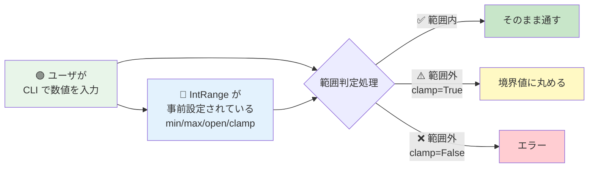
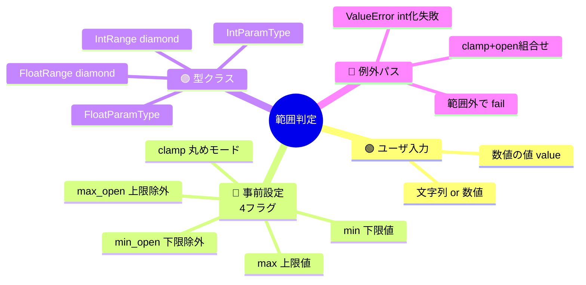
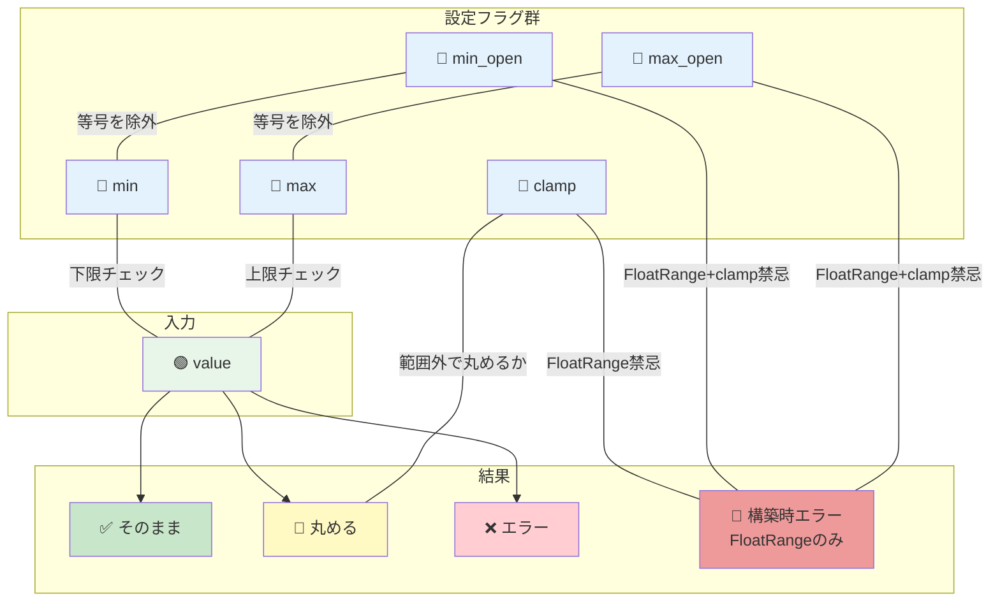

# click: トリガー×影響 可視化

> **対象**: `src/click/types.py` の `IntRange(_NumberRangeBase, IntParamType)` の `convert()`
> **質問の意図**: 「CLIで渡された数値が範囲内か？」の判定で、min/max/open/clamp の4設定がどう連動するかを、コードを読まずに理解する

---

## 1. 全体俯瞰（非エンジニア向け導入）



**このコードの面白さ**: 「範囲判定」は単純に見えて、**開発者が事前に設定した4つのフラグ** (`min_open`, `max_open`, `clamp`, 境界値) の組合せで **全16通りの挙動** が存在します。非エンジニアに伝えるには組合せの可視化が必須です。

---

## 2. トリガー階層（Sunburst風 / Mindmap）



**読み方**: ユーザが直接触るのは左上の「数値の値」だけ。しかし判定結果は、開発者が設定した **4フラグの組合せ** と **型クラス** で大きく変わります。

---

## 3. トリガーと結果の流れ（Sankey）

```mermaid
sankey-beta

CLI入力,int変換,100
int変換,変換成功,90
int変換,変換失敗,10
変換成功,範囲内判定,90
範囲内判定,範囲内,60
範囲内判定,下限未満,15
範囲内判定,上限超過,15
下限未満,clamp有効,8
下限未満,clamp無効,7
上限超過,clamp有効,8
上限超過,clamp無効,7
範囲内,✅ そのまま返す,60
clamp有効,🔄 境界値に丸める,16
clamp無効,❌ fail,14
変換失敗,❌ fail,10
```

**読み方**: 100件の入力が左から流れ、最終的に「そのまま」「丸める」「エラー」の3通りに分岐します。帯の太さで相対頻度がわかります。

---

## 4. トリガー同士の関係（Chord風）



**読み方**: 設定フラグは5つ、入力は1つ。点線は「特定条件下だけで有効な関係」。特に **min_open + max_open + clamp の組合せは FloatRange では構築時エラー** （設計上の禁忌）となる珍しい関係が表現されています。

---

## 5. 複合影響のヒートマップ（本対象の中核）

`min=0, max=5` 設定下での、各 value × 各フラグ組合せの結果:

### 5.1 IntRange の挙動（clamp=False）

| value \ フラグ | `min_open=F, max_open=F` | `min_open=T, max_open=F` | `min_open=F, max_open=T` | `min_open=T, max_open=T` |
|---|---|---|---|---|
| value = -1 | ❌ 範囲外 | ❌ 範囲外 | ❌ 範囲外 | ❌ 範囲外 |
| value = 0 | ✅ 0 | ❌ 下限除外 | ✅ 0 | ❌ 下限除外 |
| value = 3 | ✅ 3 | ✅ 3 | ✅ 3 | ✅ 3 |
| value = 5 | ✅ 5 | ✅ 5 | ❌ 上限除外 | ❌ 上限除外 |
| value = 6 | ❌ 範囲外 | ❌ 範囲外 | ❌ 範囲外 | ❌ 範囲外 |

### 5.2 IntRange の挙動（clamp=True）

| value \ フラグ | `min_open=F, max_open=F` | `min_open=T, max_open=F` | `min_open=F, max_open=T` | `min_open=T, max_open=T` |
|---|---|---|---|---|
| value = -1 | 🔄 → 0 | 🔄 → 1 | 🔄 → 0 | 🔄 → 1 |
| value = 0 | ✅ 0 | 🔄 → 1 | ✅ 0 | 🔄 → 1 |
| value = 3 | ✅ 3 | ✅ 3 | ✅ 3 | ✅ 3 |
| value = 5 | ✅ 5 | ✅ 5 | 🔄 → 4 | 🔄 → 4 |
| value = 6 | 🔄 → 5 | 🔄 → 5 | 🔄 → 4 | 🔄 → 4 |

### 5.3 FloatRange の挙動差異（v3.1 検出）

| 設定 | FloatRange | IntRange | 差異 |
|---|---|---|---|
| `clamp=True, min_open=True` | 🚫 構築時 TypeError | 🔄 許容（value→min+1） | 🔴 **言語間差異** |
| `clamp=True, max_open=True` | 🚫 構築時 TypeError | 🔄 許容（value→max-1） | 🔴 **言語間差異** |
| `clamp=False` | ✅ 動作 | ✅ 動作 | — |

**重要な発見**: IntRange と FloatRange は API が同じに見えて **構築時の許容条件が異なる**（本研究 v3.1 の EN 検証で明示化された観点）。非エンジニアが同じ感覚で両者を使うと、FloatRange では予期せぬエラーに遭遇します。

---

## 6. 3次元化の検討（推奨しない）

ユーザーからは 3D グラフの可能性も問われましたが、本対象では以下が 3D 候補になり得ます:

- **軸1**: value の値域
- **軸2**: min_open/max_open の組合せ（4通り）
- **軸3**: clamp の有無
- **色**: 結果（pass/clamp/fail）

ただし描画すると:
- 手前の value=3 付近が大半を占める「山」になる
- 境界面（pass↔clamp↔fail の遷移）が奥に隠れる
- 静的媒体で回転できない

よって **セクション5のヒートマップ2枚（clamp×on/off）の対照** が最も効率的です。3D Surface Plot は参考資料（PowerPoint等）に補助資料として置く程度。

---

## 7. まとめ（非エンジニア向け）

### このコードの本質

CLI で渡された数値を「範囲に入っているか」判定するだけ、のはずが:

- 境界を **含むか/除くか** (`min_open`/`max_open`) で4通り
- 範囲外を **エラーにするか/丸めるか** (`clamp`) で2通り
- つまり **8通りの設定ごとに挙動が異なる**
- さらに IntRange と FloatRange で **構築時の許容差** がある

### 非エンジニアへの伝達のキー

本対象は **複合影響の豊富さ** が本質。それを伝えるには:

1. **ヒートマップ（5.1/5.2/5.3）が最も効く**: 全組合せを表で見渡せる
2. **Sankey（§3）は "頻度" を直感化する**: どの結果が多いか
3. **Chord（§4）は "禁忌組合せ" を強調できる**: FloatRange+open+clamp の赤線
4. **Sunburst（§2）は導入として機能**: 何が効くかの地図

3D は **有効でない**（情報密度は高いが遮蔽で読めない）。

### トリガー比較（リバーシ / sakura / click）

| 対象 | ユーザトリガー | 設定トリガー | 複合影響の豊富さ |
|---|---|---|---|
| リバーシ | 1 | 0 | 低（判定はほぼ一意） |
| sakura IsMailAddress | 1 | 1 (offset) | 中（offsetと文字列の組合せ） |
| **click IntRange** | **1** | **5** | **高（16通り + 言語間差）** |

click IntRange は **少ないユーザ操作 × 多数の設定トリガー** 型で、TRM + ヒートマップ の組合せが特に効果的です。
