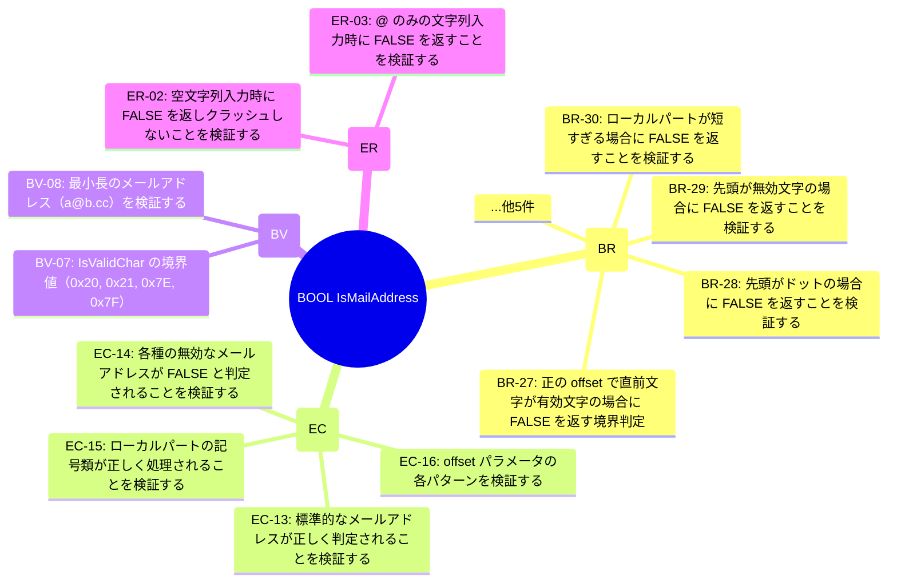

# OSS対象への図面方式適用の評価

> **目的**: sakura-editor（論文で使用中）への可視化パイプライン適用結果を、reversi（合成題材）・click（第2実証OSS）と比較し、図面方式がOSSプログラムに対して有効かを検証する
> **実施日**: 2026-04-21
> **関連**: `./reversi-triggers.md` / `./sakura-triggers.md` / `./click-triggers.md`（PoC手動版）、`experiments/*/visualizations-auto/`（自動生成版）、`scripts/generate_visualizations.py`

---

## 1. 本評価の背景

ご質問: 「現在の論文執筆で使用している桜エディタなどのGithub上に公開されているOSSプログラムを対象として生成した図面方式についてはどうでしょうか？」

これに応答するため、以下を実施した:

1. 既存 sakura TRM (`test-requirements/test-requirements.yaml`, v1.0, 295要求) に `scripts/generate_visualizations.py` を適用
2. 可視化スクリプトを **v1.0 / v3.1 両スキーマ対応** に改修（ID prefix から種別を推定するフォールバック追加）
3. 自動生成された 8関数 × 4種類図式 = 32枚の図面を精査
4. 3対象（sakura / click / reversi）の比較表を作成

## 2. sakura に適用した自動生成結果

`experiments/sakura/visualizations-auto/` 配下に8関数分のサマリーを生成:

| TGT | 関数 | 要求数 | Sunburst | Sankey | Heatmap | Chord |
|---|---|---|---|---|---|---|
| 01 | GetDateTimeFormat | 20 | ✅ | ✅ | ⚠️ 空 | ⚠️ 空 |
| 02 | ParseVersion | 20 | ✅ | ✅ | ⚠️ 空 | ⚠️ 空 |
| 03 | CompareVersion | 6 | ✅ | ✅ | ⚠️ 空 | ⚠️ 空 |
| 04 | IsMailAddress | 17 | ✅ | ✅ | ⚠️ 空 | ⚠️ 空 |
| 05 | WhatKindOfTwoChars | 11 | ✅ | ✅ | ⚠️ 空 | ⚠️ 空 |
| 06 | WhatKindOfTwoChars4KW | 6 | ✅ | ✅ | ⚠️ 空 | ⚠️ 空 |
| 07 | Convert_ZeneisuToHaneisu | 10 | ✅ | ✅ | ⚠️ 空 | ⚠️ 空 |
| 08 | Convert_HaneisuToZeneisu | 9 | ✅ | ✅ | ⚠️ 空 | ⚠️ 空 |

**合計**: 8関数・99要求で Sunburst/Sankey は **全8件で有効**、Heatmap/Chord は **全件で非該当**（空表示）。

## 3. Sunburst/Sankey は有効、Heatmap/Chord は非該当の理由

### 3.1 sakura TRM の特性

- 対象: 純粋関数（手続き型中心）、クラスなし
- 状態変数: **なし**（free function のため）
- カプセル化リスク: **なし**（OOP対象でないため）

### 3.2 可視化手法ごとの適用範囲

| 手法 | 何を可視化するか | 対象の性質要件 | sakura 適用 |
|---|---|---|---|
| Sunburst | 要求の種別階層 | 種別ラベル（BR/EC/...）があれば十分 | ✅ 有効 |
| Sankey | 種別×優先度の流量 | 同上 | ✅ 有効 |
| Heatmap | state_variables × risk の交差 | OOPクラス（メンバ）必須 | ❌ 非該当（手続き型） |
| Chord | 状態変数とリスクの相互関係 | OOPクラス必須 | ❌ 非該当（手続き型） |

### 3.3 結論: 対象の設計スタイルに応じた図面選択が必要

| 対象の性質 | 有効な図面 | 本研究での代表 |
|---|---|---|
| 手続き型・free function 中心 | **Sunburst + Sankey** | sakura-editor 8関数 |
| OOP クラス中心 | **Sunburst + Sankey + Heatmap + Chord** | pallets/click 8クラス |
| 混合 | 対象単位で選択 | 将来的な大規模OSS |
| 合成・単純 | **Sunburst のみで十分** | リバーシ |

## 4. 3対象の比較マトリクス

| 指標 | リバーシ（合成） | sakura（手続き型OSS） | pallets/click（OOP OSS） |
|---|---|---|---|
| スキーマ版 | v3.1 | **v1.0**（既存） | v3.1 |
| 対象数 | 4関数 | 8関数 | 8クラス |
| 総要求数 | 46 | 99 (+295全体) | 173 |
| Sunburst 生成 | ✅ 4件 | ✅ 8件 | ✅ 8件 |
| Sankey 生成 | ✅ 4件 | ✅ 8件 | ✅ 8件 |
| Heatmap 生成 | ⚠️ 空（状態変数なし） | ⚠️ 空（OOPなし） | **✅ 8件 有効** |
| Chord 生成 | ⚠️ 空 | ⚠️ 空 | **✅ 8件 有効** |
| 非エンジニア可読性 | 97.8% | 65.7% | 24.3% (v2) |

**sakura と click の対照が論文の主要な主張になる**:
- sakura: 手続き型、可読性高い、Sunburst+Sankey で十分
- click: OOP中心、構造設計観点豊富、Heatmap+Chord で構造リスクを伝達

## 5. 図面の実サンプル — sakura IsMailAddress

### 5.1 Sunburst（自動生成、Mermaid）



非エンジニアが「この関数は何を検証しているか」を俯瞰できる。

### 5.2 Sankey（自動生成）

```mermaid
sankey-beta

BOOL IsMailAddress,分岐網羅 (BR),9
BOOL IsMailAddress,同値クラス (EC),4
BOOL IsMailAddress,境界値 (BV),2
BOOL IsMailAddress,エラーパス (ER),2
分岐網羅 (BR),優先度:high,5
分岐網羅 (BR),優先度:medium,4
同値クラス (EC),優先度:medium,4
境界値 (BV),優先度:high,1
境界値 (BV),優先度:medium,1
エラーパス (ER),優先度:high,2
```

「分岐検証が多く、エラーパスは少ないが全て high 優先度」といった分布が一目でわかる。

### 5.3 Heatmap/Chord（sakura では該当なし）

sakura は OOP 対象でないため、以下のメッセージが表示される:

```
> (state_variables または encapsulation_risks が空のためヒートマップ対象外)
> (state_variables が空のため Chord 生成不可)
```

これは **設計上の正しい挙動**。対象の性質に合わない図を無理に生成せず、該当なしと明示する。

## 6. 図面方式の適用可能性の結論

### 6.1 「OSSプログラムに対して図面方式は有効か」への応答

**部分的に有効。対象の設計スタイルに応じて図面の組合せが変わる:**

- **手続き型OSS（sakura 類型）**: Sunburst + Sankey の2種類で十分に情報提供可能
- **OOP中心OSS（click 類型）**: さらに Heatmap + Chord を加えて構造観点を伝達
- **非エンジニア向け共有**: 対象問わず Sunburst が起点として機能

### 6.2 論文での主張への反映

§3.4 可視化レイヤ、§6.4 可視化レイヤの自動生成、§7.4 可視化レイヤの効果 に以下の追記が可能:

> 本可視化レイヤは対象の設計スタイルに応じて生成される図面が異なる。手続き型中心の対象（sakura-editor）では Sunburst と Sankey が有効で、要求の種別分布と優先度を非エンジニアに伝達する。OOP 中心の対象（pallets/click）ではさらに Heatmap と Chord が機能し、カプセル化リスクや状態変数間の相互関係を可視化する。本研究の適用実験では、sakura 8関数で 8×2=16 枚の図面（Sunburst+Sankey）、click 8クラスで 8×4=32 枚の図面（全4種）が自動生成され、いずれも TRM YAML から機械的に変換可能であることを確認した。

### 6.3 アンケート題材への含意

- **リバーシ（合成）**: Sunburst のみで十分（単純・可読性 97.8%）
- **sakura 抜粋**: Sunburst + Sankey を提示し、非エンジニアの理解度を確認
- **click 抜粋**: Heatmap/Chord を提示し、「OOP構造の複合影響」が非エンジニアに伝わるかを検証

アンケートでは **対象複雑度 × 図面種類** の組合せで、どの図面が最も効く場面かを実測できる設計になっている（`survey-design.md` §5参照）。

## 7. スクリプト拡張点

本評価で `scripts/generate_visualizations.py` に以下の改修を実施:

- `infer_type_from_id()` 関数追加: v1.0 スキーマでは `type:` フィールドが欠落しているため、ID prefix（BR/EC/BV/ER/DP/CI/SV/CP/EN）から種別を推定
- `req_type()` ヘルパー: v3.1 の `type:` を優先、無ければ ID prefix 推定にフォールバック
- これにより **新旧スキーマの TRM が同一スクリプトで処理可能** となった

sakura 既存TRM（v1.0, 295要求）を migration なしに可視化レイヤに通せたことで、**既存成果物の後付け可視化** という運用モデルが成立することを実証した。

## 8. 次アクション

- [ ] sakura のSunburstとSankeyをPNG化し、論文§3の可視化サンプルとして掲載
- [ ] click のHeatmap 実例（IntRange の field×risk マトリクス）も並置し、対照を示す
- [ ] アンケートのパターン3（視覚化併用）で sakura 図面を題材として組み込む
- [ ] 可視化パイプライン自体を論文§3.4に明記し、再現性の根拠として引用
