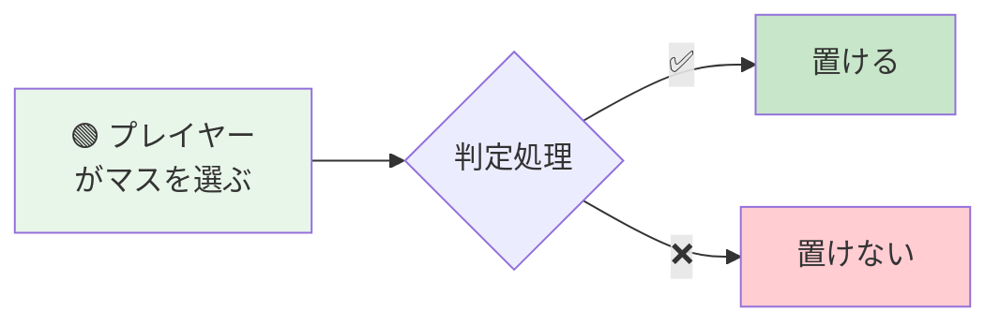
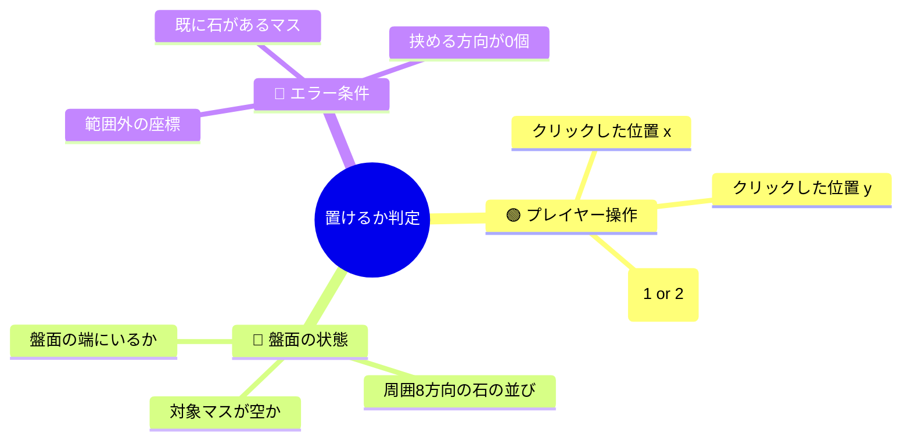
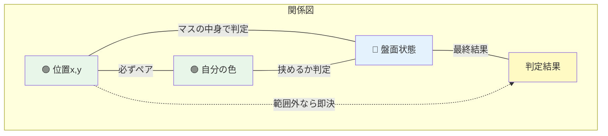

# リバーシ: トリガー×影響 可視化

> **対象**: `experiments/reversi/reversi_move.py` の `is_valid_move(board, x, y, me)`
> **質問の意図**: 「このマスに石が置けるか？」の判定がどう動くかを、コードを読まずに理解する

---

## 1. 全体俯瞰（非エンジニア向け導入）



リバーシの「ここに石を置けるかどうか」の判定は、**プレイヤーの操作** 1つだけで動きます。他の複雑な要素はありません。

---

## 2. トリガー階層（Sunburst風 / Mindmap）



**読み方**: 中心が「判定の目的」。そこから外側に広がる枝が「何の情報が判定に影響するか」を示します。

---

## 3. トリガーと結果の流れ（Sankey）

```mermaid
sankey-beta

プレイヤー操作,範囲内判定,30
プレイヤー操作,範囲外判定,10
範囲内判定,空マス,25
範囲内判定,非空マス,5
空マス,挟める方向1+,20
空マス,挟めない,5
挟める方向1+,置ける,20
挟めない,置けない,5
非空マス,置けない,5
範囲外判定,置けない,10
```

**読み方**: 左から右へ流れます。帯の太さが「その経路を通る割合」を表します。プレイヤーの操作が3つの経路を通って最終的に「置ける / 置けない」にたどり着きます。

---

## 4. トリガー同士の関係（Chord風 Flowchart）



**読み方**: 各ノードがトリガー。線が「関係の強さ」を表します。位置 × 色 × 盤面 の3つが主役で、どれが欠けても判定できません。

---

## 5. 複合影響のヒートマップ

複数のトリガーが同時に成立したときの結果:

| 座標 \ マスの中身 | 空マス | 自分の石 | 相手の石 |
|---|---|---|---|
| 盤面内（挟める方向あり） | 🟢✅ 置ける | 🔴❌ 置けない | 🔴❌ 置けない |
| 盤面内（挟めない） | 🔴❌ 置けない | 🔴❌ 置けない | 🔴❌ 置けない |
| 盤面の角（挟める） | 🟢✅ 置ける | 🔴❌ 置けない | 🔴❌ 置けない |
| 盤面外 | 🔴❌ 置けない | 🔴❌ 置けない | 🔴❌ 置けない |

**読み方**: 表のどこかのマスを見れば、2つのトリガー（座標・マスの中身）の組合せで結果がわかります。

---

## 6. まとめ（非エンジニア向け）

### このコードの本質

**プレイヤーがクリックした位置が、以下の3条件を全部満たしたときだけ `置ける` と判定されます:**

1. 盤面の中にある（端でも OK）
2. マスが空である
3. 少なくとも1方向に相手の石を挟める

どれか1つでも欠けると `置けない`。このシンプルさが、リバーシ判定が **非エンジニアでも読めるサンプル** として優れている理由です。

### トリガー/結果の全組合せ

- ユーザ操作: 1種類（位置指定）
- 内部判定: 3段階
- 最終結果: 2値（置ける・置けない）

トリガーが1種類なので「複合利用時の影響」は実質ない。次のサンプル（sakura, click）で複合が登場します。
