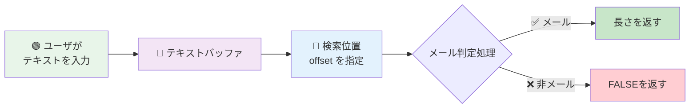
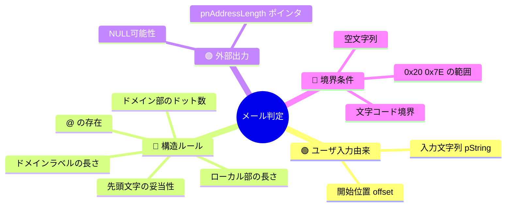
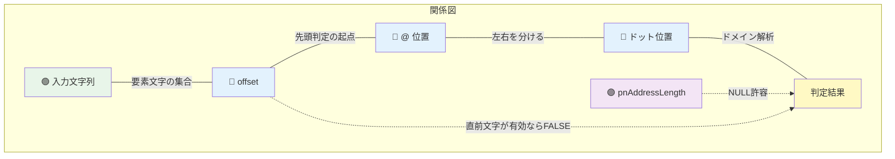
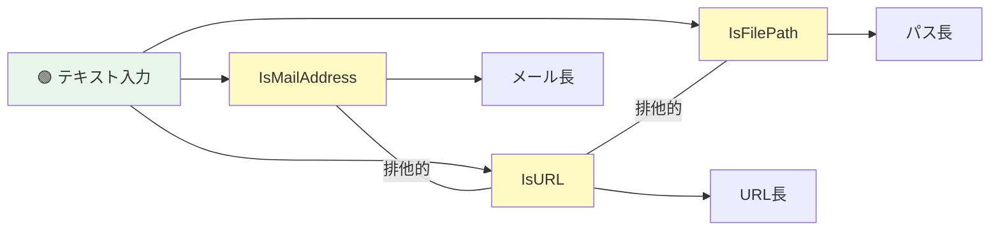

# sakura-editor: トリガー×影響 可視化

> **対象**: `sakura_core/parse/CWordParse.cpp` の `IsMailAddress(const ACHAR*, int offset, int* pnAddressLength)`
> **質問の意図**: 「この文字列はメールアドレスか？」の判定がどう動くかを、コードを読まずに理解する

---

## 1. 全体俯瞰（非エンジニア向け導入）



ユーザが入力したテキストの中から **メールアドレスらしき文字列** があるかを、指定位置 (offset) から判定します。

---

## 2. トリガー階層（Sunburst風 / Mindmap）



**読み方**: メール判定には「ユーザ入力」「形式ルール」「出力先」「境界」の4系統のトリガーが絡みます。リバーシ（1系統）より複雑。

---

## 3. トリガーと結果の流れ（Sankey）

```mermaid
sankey-beta

ユーザ操作,テキスト入力,100
テキスト入力,offset指定,100
offset指定,先頭妥当性チェック,100
先頭妥当性チェック,合格,60
先頭妥当性チェック,失敗,40
合格,@検索,60
@検索,見つかる,50
@検索,見つからない,10
見つかる,ドメイン解析,50
見つからない,❌ 非メール,10
ドメイン解析,ラベル検証OK,35
ドメイン解析,ドット不足,15
ラベル検証OK,✅ メール判定,35
ドット不足,❌ 非メール,15
失敗,❌ 非メール,40
```

**読み方**: 入力テキストが左、最終判定が右。途中の各チェックで「何件がどちらへ流れたか」が帯の太さでわかります。**"ドット不足" と "先頭不正" が主な落選理由** だと一目瞭然。

---

## 4. トリガー同士の関係（Chord風）



**読み方**: 実線が必須依存、点線が任意依存。OFFSET → AT → DOT の順にチェックが進みます。

---

## 5. 複合影響のヒートマップ

ユーザ入力の代表的パターンと offset 位置の組合せで、判定結果がどうなるか:

| 入力 \ offset | offset=0（先頭） | offset=途中<br/>直前が有効文字 | offset=途中<br/>直前がスペース等 |
|---|---|---|---|
| `"a@b.cc"` | ✅ メール | ⚠️ FALSE<br/>（"メール継続中"判定） | ✅ メール |
| `".abc@d.co"` | ❌ 先頭がドット | ❌ 同上 | ❌ 同上 |
| `"a@bcom"` | ❌ ドット不足 | — | ❌ ドット不足 |
| `"abc"` | ❌ @ 不足 | — | ❌ @ 不足 |
| `""` 空文字列 | ❌ FALSE | — | — |
| `"user+tag@x.co"` | ✅ メール | ⚠️ 直前文字次第 | ✅ メール |

**読み方**: 横軸が offset（検索位置）の種類、縦軸が文字列の形。2つを組合せて結果を読み取ります。**同じメール形式でも offset の前文字次第で判定が変わる** 点が非自明で、このヒートマップで視覚化されます。

---

## 6. 他関数との相互作用（関連機能の全体像）

CWordParse.cpp 内の関連判定との関係:



**注**: IsMailAddress は URL 判定・ファイルパス判定と **排他的に試される**（サクラエディタの仕組み）。ユーザ操作はテキスト入力1つだが、裏では複数の判定関数が "誰が最初にマッチするか" 競う。

---

## 7. まとめ（非エンジニア向け）

### このコードの本質

入力テキストの特定位置から見て、以下の全条件を満たすとメールと判定されます:

1. 先頭が有効な文字（英数字等）で始まる
2. `@` が含まれている
3. ドメイン部にドット `.` が1つ以上ある
4. ドメインラベル（ドット区切りの各部分）が空でない
5. offset が 0 より大きい場合、直前の文字が区切り（空白等）である

→ **メールらしい見た目** と **区切りの位置関係** の両方が必要。

### トリガー数と結果

- ユーザ操作: 1系統（テキスト入力）
- 内部トリガー: 5種類のルール + offset 依存
- 結果: TRUE/FALSE の2値 + 長さ出力

リバーシ（1系統・3判定）に比べ、**内部トリガーが倍以上**。非エンジニアに伝える場合は **ヒートマップが最も効果的** と推察します。
