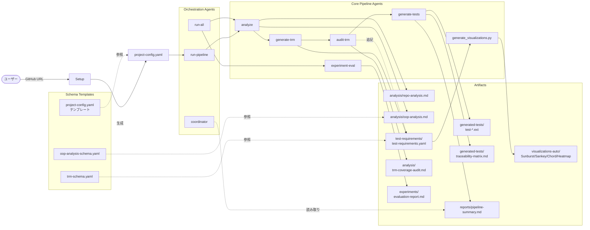
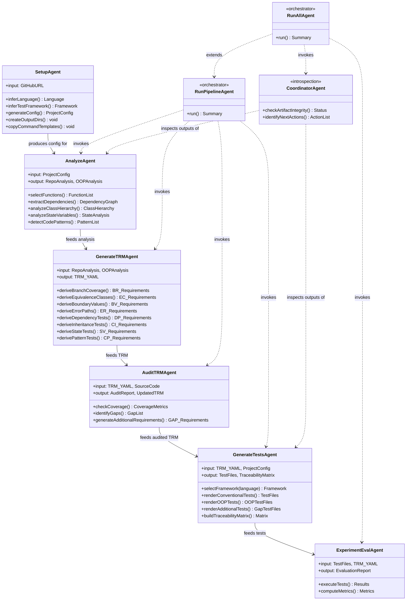
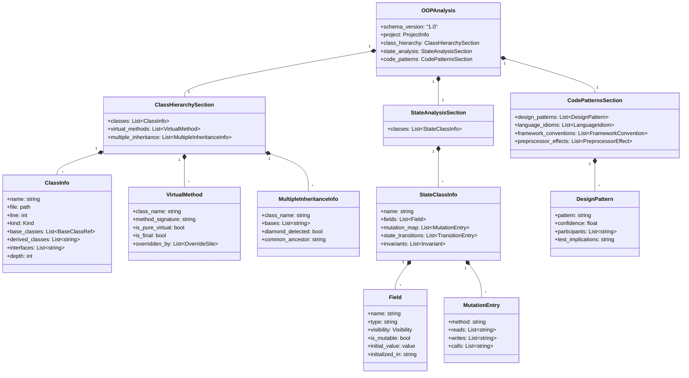
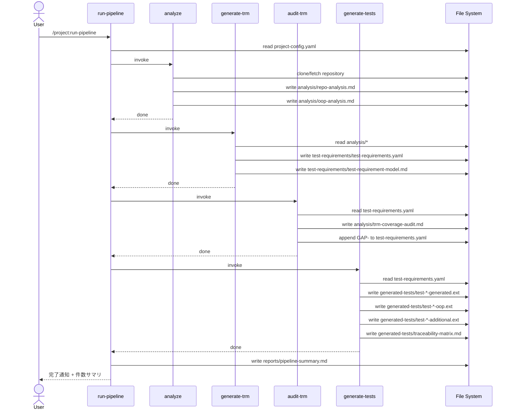

# TRMパイプライン アーキテクチャ図

> **目的**: v3.1（OOP + EN 拡張）のシステム構造を、エージェント・スキーマ・成果物の3層で可視化
> **関連**: `./operation-guide.md`（運用手順）、`/SoftwareQualitySymposium/CLAUDE.md`（コマンド一覧）
> **描画形式**: Mermaid（GitHub/VSCode標準プレビュー対応）

---

## 1. 全体俯瞰図（コンポーネント関係）



---

## 2. エージェント クラス図

エージェント間の責務と情報の流れをクラス図として整理。



---

## 3. データモデル クラス図（TRMスキーマ v3.0）

TRMのデータ構造をクラスとして図示。

```mermaid
classDiagram
    class TRM {
        +schema_version: "3.0"
        +project: ProjectInfo
        +targets: List~Target~
    }

    class ProjectInfo {
        +name: string
        +repository: URL
        +branch: string
        +language: Language
        +test_framework: Framework
    }

    class Target {
        +id: string (TGT-NN)
        +file: path
        +function_signature: string
        +class_name: string
        +responsibility: string
        +code_lines: int
        +preconditions: List~string~
        +constraints: List~string~
        +branch_conditions: List~BranchCondition~
        +equivalence_classes: List~EquivalenceClass~
        +boundary_values: List~BoundaryValue~
        +dependencies: Dependencies
        +class_hierarchy: ClassHierarchy
        +inheritance_conditions: List~InheritanceCondition~
        +state_variables: List~StateVariable~
        +state_transitions: List~StateTransition~
        +state_dependent_branches: List~StateDependentBranch~
        +code_patterns: List~CodePattern~
        +test_requirements: List~TestRequirement~
    }

    class BranchCondition {
        +id: BC-NN-NN
        +line_hint: string
        +condition: string
        +true_action: string
        +false_action: string
    }

    class EquivalenceClass {
        +id: EQ-NN-NN
        +parameter: string
        +class_name: string
        +representative: value
        +description: string
    }

    class BoundaryValue {
        +id: BND-NN-NN
        +parameter: string
        +boundary: string
        +on_value: value
        +off_value: value
    }

    class Dependencies {
        +calls: List~string~
        +called_by: List~string~
        +globals: List~string~
        +stub_strategy: string
    }

    class ClassHierarchy {
        +base_classes: List~string~
        +derived_classes: List~string~
        +interfaces: List~string~
        +is_virtual: bool
        +is_override: bool
        +is_abstract: bool
        +overrides: List~OverrideInfo~
    }

    class InheritanceCondition {
        +id: IC-NN-NN
        +type: Subtype
        +base_class: string
        +derived_class: string
        +condition: string
        +expected_behavior: string
    }

    class StateVariable {
        +id: SVAR-NN-NN
        +name: string
        +type: string
        +visibility: Visibility
        +initial_value: value
        +mutable: bool
    }

    class StateTransition {
        +id: ST-NN-NN
        +variable: string
        +from_state: value
        +to_state: value
        +trigger: string
        +guard_condition: string
    }

    class StateDependentBranch {
        +id: SDB-NN-NN
        +variable: string
        +condition: string
        +affected_method: string
    }

    class CodePattern {
        +id: CPAT-NN-NN
        +category: Category
        +pattern_name: string
        +description: string
        +source_locations: List~path~
        +test_implications: string
    }

    class TestRequirement {
        <<abstract>>
        +id: string
        +type: RequirementType
        +description: string
        +priority: Priority
        +source_ref: string
        +expected_behavior: string
        +test_data: TestData
    }

    class BR_Requirement {
        +type: "branch_coverage"
    }
    class EC_Requirement {
        +type: "equivalence_class"
    }
    class BV_Requirement {
        +type: "boundary_value"
    }
    class ER_Requirement {
        +type: "error_path"
    }
    class DP_Requirement {
        +type: "dependency_path"
    }
    class CI_Requirement {
        +type: "class_inheritance"
        +subtype: CI_Subtype
        +base_class: string
        +derived_classes: List~string~
    }
    class SV_Requirement {
        +type: "state_variable"
        +subtype: SV_Subtype
        +target_variable: string
        +precondition_state: value
        +expected_state: value
    }
    class CP_Requirement {
        +type: "code_pattern"
        +subtype: CP_Subtype
        +pattern_name: string
    }
    class EN_Requirement {
        +type: "encapsulation"
        +subtype: EN_Subtype
        +target_member: string
        +expected_access_result: string
    }

    class Accessor {
        +id: ACC-NN-NN
        +field_name: string
        +getter: string
        +setter: string
        +is_leaky_getter: bool
        +is_leaky_setter: bool
    }

    class ConstructionContract {
        +id: CC-NN-NN
        +constructor_signature: string
        +required_fields: List~string~
        +optional_fields: List~string~
        +invariants_on_exit: List~string~
    }

    class EncapsulationRisk {
        +id: ENR-NN-NN
        +field_name: string
        +risk_type: string
        +severity: Severity
        +description: string
    }

    TRM "1" *-- "1" ProjectInfo
    TRM "1" *-- "*" Target
    Target "1" *-- "*" BranchCondition
    Target "1" *-- "*" EquivalenceClass
    Target "1" *-- "*" BoundaryValue
    Target "1" *-- "1" Dependencies
    Target "1" *-- "0..1" ClassHierarchy
    Target "1" *-- "*" InheritanceCondition
    Target "1" *-- "*" StateVariable
    Target "1" *-- "*" StateTransition
    Target "1" *-- "*" StateDependentBranch
    Target "1" *-- "*" CodePattern
    Target "1" *-- "*" Accessor
    Target "1" *-- "*" ConstructionContract
    Target "1" *-- "*" EncapsulationRisk
    Target "1" *-- "*" TestRequirement

    TestRequirement <|-- BR_Requirement
    TestRequirement <|-- EC_Requirement
    TestRequirement <|-- BV_Requirement
    TestRequirement <|-- ER_Requirement
    TestRequirement <|-- DP_Requirement
    TestRequirement <|-- CI_Requirement
    TestRequirement <|-- SV_Requirement
    TestRequirement <|-- CP_Requirement
    TestRequirement <|-- EN_Requirement

    BR_Requirement ..> BranchCondition : source_ref
    EC_Requirement ..> EquivalenceClass : source_ref
    BV_Requirement ..> BoundaryValue : source_ref
    CI_Requirement ..> InheritanceCondition : source_ref
    SV_Requirement ..> StateTransition : source_ref
    CP_Requirement ..> CodePattern : source_ref
    EN_Requirement ..> Accessor : source_ref
    EN_Requirement ..> ConstructionContract : source_ref
    EN_Requirement ..> EncapsulationRisk : source_ref
```



### 3.1 サブタイプ一覧

| 種別 | サブタイプ |
|---|---|
| **CI_Subtype** | polymorphic_dispatch / override_correctness / liskov_substitution / abstract_coverage / super_delegation / interface_contract |
| **SV_Subtype** | initialization / mutation_sequence / invariant_maintenance / state_dependent_behavior / lifecycle / cross_method_state / **member_declaration_validity** (v3.1) / **member_initialization_requirement** (v3.1) |
| **CP_Subtype** | design_pattern_conformance / idiom_correctness / resource_lifecycle / concurrency_safety / framework_contract / macro_expansion |
| **EN_Subtype** (v3.1) | access_control_correctness / leaky_accessor / mutability_contract / construction_contract / invariant_surface |

---

## 4. OOP解析スキーマ クラス図

`analyze` エージェントの出力（`oop-analysis.md` の構造化版）のデータモデル。



---

## 5. パイプライン実行シーケンス

`/project:run-pipeline` 実行時のエージェント呼び出し順序。



---

## 6. 言語別テストフレームワーク ディスパッチ

`generate-tests` エージェントの言語別分岐。

```mermaid
flowchart TD
    Start[generate-tests 起動] --> ReadConfig[project-config.yaml 読込]
    ReadConfig --> Switch{project.language}
    Switch -->|C++| Cpp[Google Test / Catch2<br/>TEST / TEST_F<br/>EXPECT_*]
    Switch -->|Python| Py[pytest<br/>test_* 関数<br/>parametrize / fixtures]
    Switch -->|Java| Java[JUnit<br/>@Test / @BeforeEach<br/>Assertions.*]
    Switch -->|TypeScript| TS[Jest / Vitest<br/>test / describe<br/>beforeEach]
    Switch -->|Go| Go[testing<br/>TestXxx 関数<br/>t.Run サブテスト]
    Switch -->|Rust| Rust[cargo test<br/>#test attribute<br/>mod tests]
    Cpp --> Render
    Py --> Render
    Java --> Render
    TS --> Render
    Go --> Render
    Rust --> Render
    Render[TRM ID 毎にテストケースをレンダリング]
    Render --> WriteFiles[generated-tests/ に出力]
```

---

## 7. 設定ファイルと成果物の対応表

| 設定項目 | 影響を受けるフェーズ | 影響を受ける成果物 |
|---|---|---|
| `project.language` | analyze, generate-trm, generate-tests | すべての解析・生成物 |
| `project.test_framework` | generate-tests | `generated-tests/*.ext` |
| `selection_criteria.*` | analyze | `analysis/repo-analysis.md` |
| `trm.types` | generate-trm | `test-requirements.yaml` |
| `trm.include_audit` | audit-trm | `trm-coverage-audit.md` |
| `oop_analysis.enabled` | analyze, generate-trm, generate-tests | `oop-analysis.md`, CI/SV/CP 要求 |
| `oop_analysis.class_inheritance.*` | analyze, generate-trm | CI 要求、階層解析 |
| `oop_analysis.state_variables.*` | analyze, generate-trm | SV 要求、状態解析 |
| `oop_analysis.code_patterns.*` | analyze, generate-trm | CP 要求、パターン検出 |
| `output.*` | 全フェーズ | 出力先ディレクトリ |

---

## 8. 補足：描画・更新のメンテナンス

- **描画確認**: VSCode + Mermaid拡張、または GitHub の Markdown プレビュー
- **更新タイミング**:
  - スキーマ v3.x → v4.x に上げるとき
  - エージェント（`.claude/commands/*.md`）の責務を変更したとき
  - 出力ファイル構造を変えたとき
- **同期対象**: `templates/trm-schema.yaml`, `templates/oop-analysis-schema.yaml`, `templates/project-config.yaml`, `.claude/commands/*.md`
