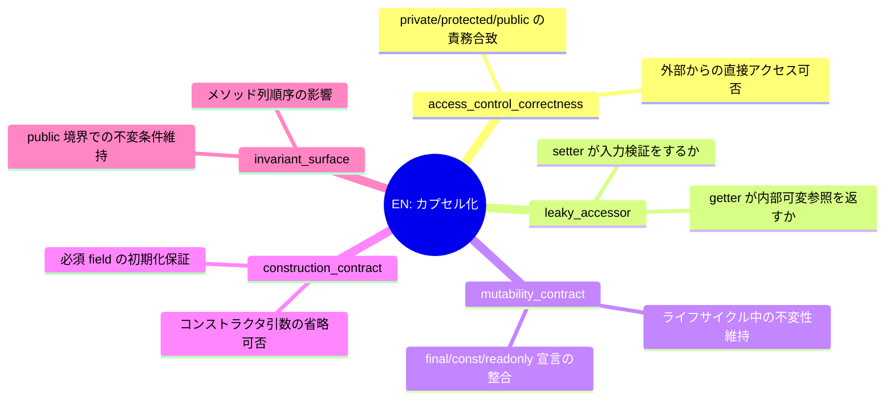
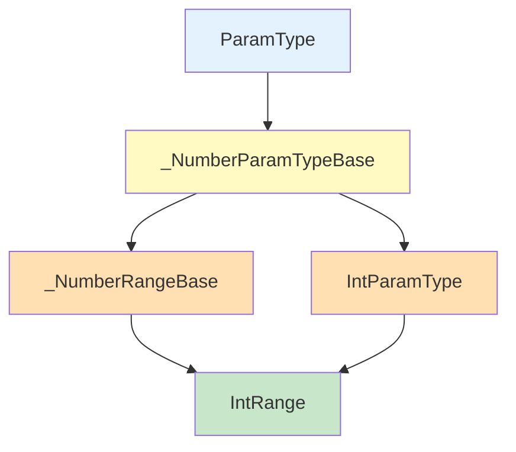

# 論文図版プラン

> **目的**: `paper-draft-full.md` に挿入する図版を列挙し、生成手順を定義する
> **描画形式**: Mermaid ソース → PNG（投稿docxへの埋込用）
> **生成方法**: mermaid-cli (`mmdc`) または mermaid.live (web)

---

## 1. 論文必須図版一覧

### 図 3.1: パイプライン全体俯瞰

**配置**: §3.1 手法の全体像
**ソース**: `knowledge/architecture-diagram.md` §1 全体俯瞰図
**意図**: ユーザ入力（URL）→ 5段階の Core Pipeline → Artifacts までを一画面で提示
**サイズ**: 横幅 16cm（見開き左右一杯）

### 図 3.2: TRM スキーマ v3.1 のデータモデル

**配置**: §3.2 TRM v3.1 スキーマ
**ソース**: `knowledge/architecture-diagram.md` §3 データモデル クラス図
**意図**: `TestRequirement` 抽象クラスから BR/EC/BV/ER/DP/CI/SV/CP/EN 9種別への継承階層
**サイズ**: 縦長（A4 を想定し、半分〜2/3）

### 図 3.3: EN 種別の5サブタイプと検出対象

**配置**: §3.3 EN の設計
**形式**: Mermaid mindmap (新規作成)
**ソース**: 以下をコピペで使用可



### 図 4.1: 実証対象の比較マトリクス

**配置**: §4.2 選定結果
**形式**: 表（Markdown 形式、docx ではスタイル付き table）
**内容**: `paper-draft-full.md` §4.2 の既存表を転用

### 図 6.1: 可読率の3対象比較（棒グラフ）

**配置**: §6.5 可読率の自動分類結果
**形式**: 棒グラフ（matplotlib または Excel）
**データ**:
- reversi: L1 58.7% / L2 39.1% / L3 2.2% / 可読率 97.8%
- sakura: L1 38.4% / L2 27.3% / L3 34.3% / 可読率 65.7%
- click: L1 7.5% / L2 16.8% / L3 75.7% / 可読率 24.3%

### 図 6.2: click IntRange の Heatmap サンプル

**配置**: §6.4 可視化レイヤの自動生成
**ソース**: `experiments/click/visualizations-auto/IntRange-summary.md` §3
**意図**: 自動生成された Heatmap の実物例

### 図 6.3: IntRange のダイヤモンド継承（Mermaid）

**配置**: §6.2 click 実証・IntRange の解説
**形式**: Mermaid flowchart (新規)
**ソース**:



### 図 6.4: v3.1 の OOP 度依存効果（棒グラフ）

**配置**: §6.7 v3.1 の OOP 度合い依存効果
**形式**: 棒グラフ（v3.0 5種別 vs v3.1 追加種別）
**データ**:
- sakura 既存: v3.0=99, +v3.1 retrospective +7 (+7.1%)
- sakura CMemoryIterator: v3.0=21, +v3.1 +27 (+128%)
- click: v3.0=80, +v3.1 +51 (+63.8%)

### 図 7.1: 研究の問いへの応答サマリ

**配置**: §7.1/§7.2
**形式**: Mermaid flowchart または表
**意図**: 2つの問い × 3対象のマトリクス

---

## 2. 生成手順

### 2.1 ローカル環境での Mermaid → PNG

```bash
# 1回だけ: mermaid-cli のインストール
npm install -g @mermaid-js/mermaid-cli

# 個別変換
mmdc -i input.mmd -o output.png -w 1600 -H 1200

# architecture-diagram.md などから抽出するには
awk '/```mermaid/,/```/' knowledge/architecture-diagram.md \
  | sed '/```/d' > /tmp/diagram.mmd
mmdc -i /tmp/diagram.mmd -o figures/fig-3-1.png
```

### 2.2 Web フォールバック

mermaid.live にソースを貼り付け → 右上の `Actions > PNG` でダウンロード。

### 2.3 グラフ生成（棒グラフ等）

```python
import matplotlib.pyplot as plt
import matplotlib
matplotlib.rcParams['font.family'] = 'Hiragino Maru Gothic Pro'  # macOS
# または Linux: 'Noto Sans CJK JP'

fig, ax = plt.subplots(figsize=(10, 6))
targets = ['reversi', 'sakura', 'click']
l1 = [58.7, 38.4, 7.5]
l2 = [39.1, 27.3, 16.8]
l3 = [2.2, 34.3, 75.7]

ax.bar(targets, l1, label='L1 (コード知識不要)', color='#c8e6c9')
ax.bar(targets, l2, bottom=l1, label='L2 (ドメイン知識)', color='#fff9c4')
ax.bar(targets, l3, bottom=[a+b for a,b in zip(l1,l2)], label='L3 (コード知識必要)', color='#ffcdd2')

ax.set_ylabel('割合 (%)')
ax.set_title('可読性3レベル分布（3対象比較）')
ax.legend(loc='lower right')
plt.tight_layout()
plt.savefig('figures/fig-6-1-readability-comparison.png', dpi=150)
```

---

## 3. ファイル配置

```
report/
├── figures/
│   ├── fig-3-1-pipeline-overview.png
│   ├── fig-3-2-trm-schema-v3_1.png
│   ├── fig-3-3-en-subtypes.png
│   ├── fig-4-1-target-comparison.png (表画像)
│   ├── fig-6-1-readability-comparison.png
│   ├── fig-6-2-intrange-heatmap.png (Markdown表のスクショまたは自動生成)
│   ├── fig-6-3-intrange-diamond.png
│   ├── fig-6-4-oop-dependence.png
│   └── fig-7-1-research-questions.png
```

---

## 4. 論文本文への図番号挿入

以下の差分を `paper-draft-full.md` の該当箇所に適用すると、図の参照が整う:

| 章 | 挿入位置 | 追加テキスト |
|---|---|---|
| §3.1 | 段落末尾 | 「パイプライン全体の関係を図3.1に示す。」 |
| §3.2 | 表の直後 | 「スキーマのクラス図を図3.2に示す。」 |
| §3.3 | 表の直前 | 「EN の5サブタイプを図3.3に示す。」 |
| §6.2 | 表の直後 | 「IntRange のダイヤモンド継承を図6.3に示す。」 |
| §6.4 | 段落末尾 | 「自動生成された Heatmap の例を図6.2に示す。」 |
| §6.5 | 表の直後 | 「3対象の可読率を図6.1に示す。」 |
| §6.7 | 表の直後 | 「OOP 度合いと v3.1 追加率の関係を図6.4に示す。」 |

---

## 5. 投稿 docx への埋込手順

1. 図版を全て `report/figures/*.png` として生成
2. `scripts/generate_submission_v4.py` で docx 生成時に `python-docx` で埋込
3. 代替として Microsoft Word で `挿入 > 画像` で手動配置

投稿先のテンプレート要件（SQiP の場合は docx 形式で A4 2〜6ページ）を確認して最終調整。

---

## 6. 現状の優先順位

| 図 | 優先度 | 理由 | 作成工数 |
|---|---|---|---|
| 図 6.1 可読率比較 | **高** | 本研究の主要な定量結果 | 30分 |
| 図 3.1 パイプライン | 高 | 手法の全体像提示 | 15分 |
| 図 6.4 OOP依存効果 | 高 | v3.1 の価値を示す核 | 30分 |
| 図 3.2 TRM スキーマ | 中 | 参照用、複雑でも可 | 45分 |
| 図 3.3 EN サブタイプ | 中 | 新規貢献の可視化 | 15分 |
| 図 6.3 ダイヤモンド継承 | 中 | click の複雑性実例 | 15分 |
| 図 6.2 Heatmap サンプル | 低 | 自動生成品の切り抜き | 10分 |
| 図 4.1 実証対象比較 | 低 | 表でも可 | 10分 |
| 図 7.1 問い応答 | 低 | 省略可 | 30分 |

**合計作業時間**: 約 3.5 時間（9図全て）、優先3図のみなら **75分**。
